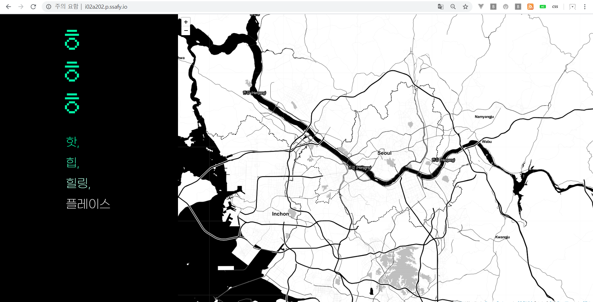
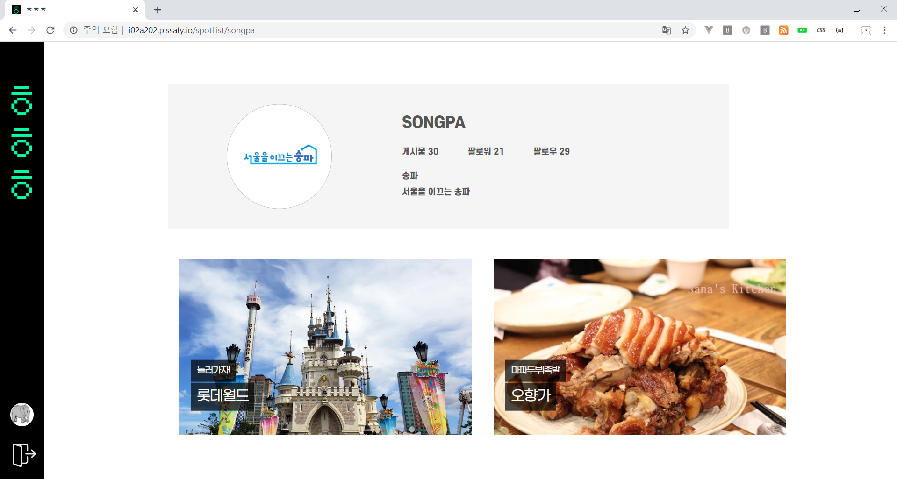
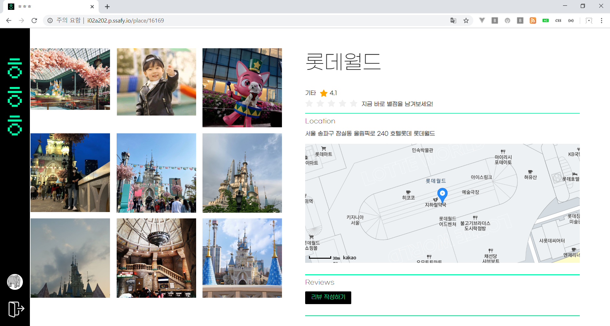
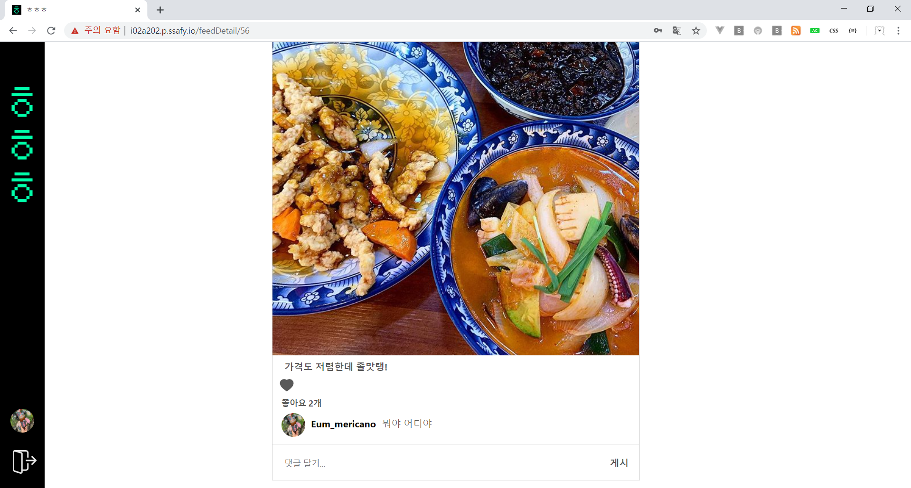
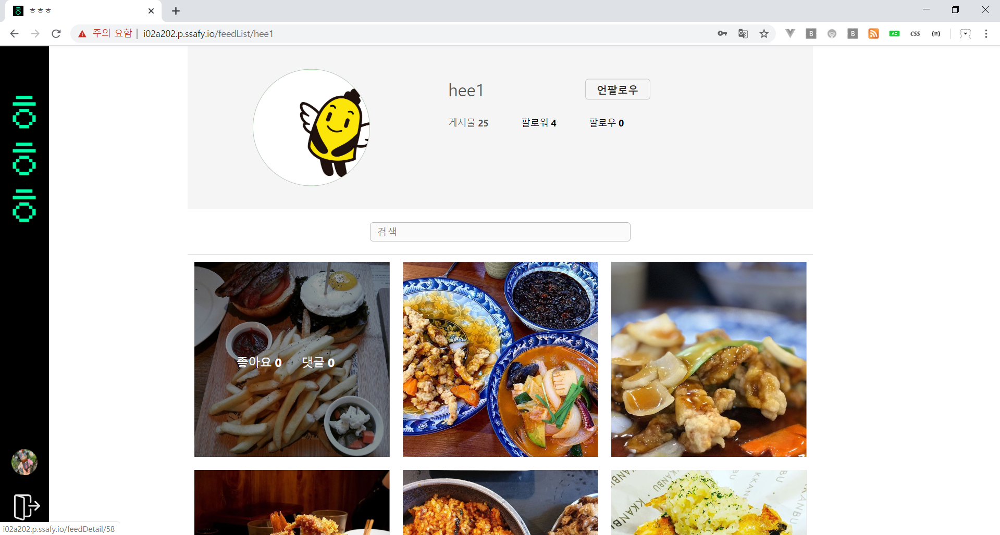
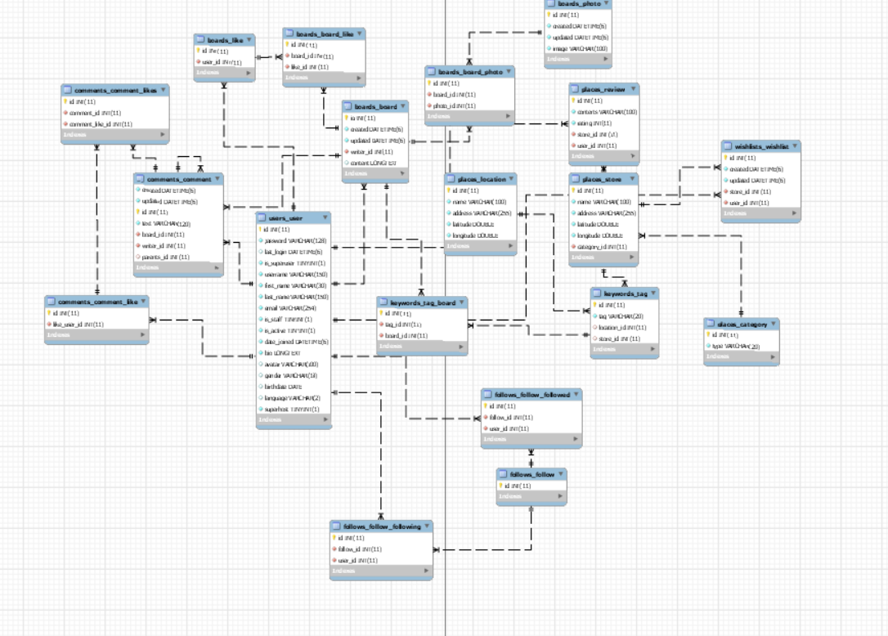

# ㅎㅎㅎ (핫, 힙, 힐링)
### 빅데이터 핫플레이스 추천 SNS

http://i02a202.p.ssafy.io/
  
---
### 프론트엔드   
> MainPage   
- 인구수, 카드사 매출 정보를 통해 2~30대의 활동이 증가하거나 많은 지역을 한눈에 확인할 수 있습니다.    
- 팀원간 협의를 통해 데이터를 기반으로 적합한 핫플레이스 결과를 도출했습니다.   
- 그 지역의 느낌을 sns를 스크랩한 내용들을 확인할 수 있습니다.   
     
    
> Location Recommend     
- 지역별, 유저별 추천 장소들을 리스트화 하여 확인할 수 있습니다.    
- 장소에 별점을 추가하면 유저가 더 재밌게 놀 수 있는 공간들을 찾을 수 있습니다.      
- 빅데이터 (협업필터링 알고리즘, Matrix Factorization 기법 사용)    
      
    
> Spot Board    
- 점포, 지역의 위치정보와 평점들을 볼 수 있고, 유저 별점을 주거나 게시글을 작성할 수 있습니다.    
- 해당 spot의 게시글에 등록된 사진들을 간략히 볼 수 있고 클릭시 게시물을 열람합니다.    
   
     
> Feed    
- 게시물을 한눈에 확인할 수 있습니다.   
      

> FeedList
- 유저별 팔로우한 사람들의 게시글과 해당 유저의 게시글들을 모아볼 수 있는 공간입니다.        
  

> User   
- 유저의 팔로우, 팔로워, 게시글 수를 확인할 수 있고 또 작성한 게시글과 각 게시글의 좋아요, 댓글들을 확인할 수 있습니다.         
     

---
### 백엔드
> django Model 구성
```
- 모델설계
    게시글, 댓글, 팔로우, 위시리스트, 유저, 태그, 지역, 가게
```
      
   
> Web Crawling

- 크롤러 분류 - 상태 유무, JavaScript 유무
- Request 요청 주의 할 점 - 서버 부하 고려
- 콘텐츠 저작권 문제

selenium / beautifulsoup
- 인스타그램을 통한 감정분석

---
### 사용 스택
      
      
       
       
      


### 사용 데이터
```
다이닝코드
카드사 결제 데이터
서울시 생활인구
문화공간 데이터
웹 스크래퍼
```
---
### 배포 내용

http://i02a202.p.ssafy.io/   

프론트엔드 배포 : nginx

백엔드 배포 : screen, WSGI(Gunicorn)   
  

> WSGI 참고자료
https://paphopu.tistory.com/37


### 배포 참고
django 배포
https://dailyheumsi.tistory.com/19   

gunicorn  실행
https://wikidocs.net/6601

react 배포
https://codechacha.com/ko/deploy-react-with-nginx/   

nginx 80포트 에러
https://jootc.com/p/201806261346   